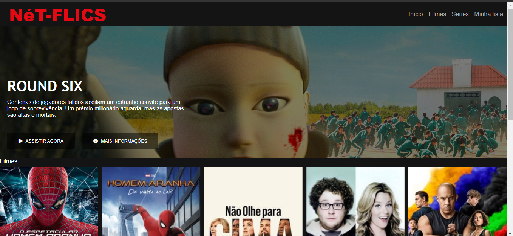

# Nét-Flics (netFliquis)

## Esse projeto prático tem como objetivo desenvolver um website replicando o layout do site de streaming de vídeo Netflix..

### Projeto desenvolvido no bootcamp TakeBlip Web developer e atualizado conforme avanço das aulas.

